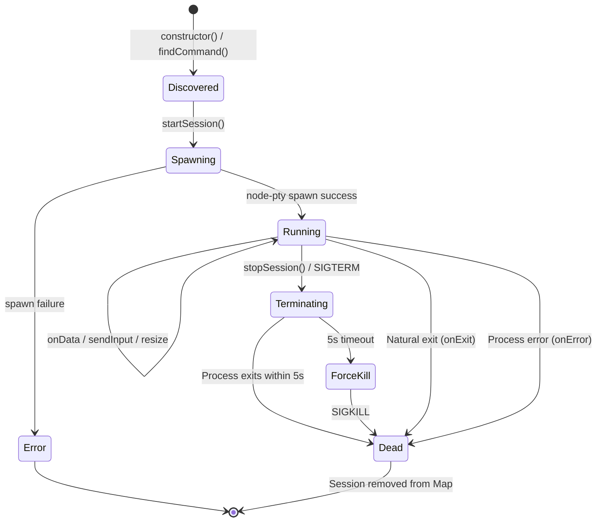

# Bridge Pattern

The bridge pattern is the core extensible architecture that allows ai-or-die to support multiple CLI tools through a uniform interface. Each CLI tool is wrapped in a bridge class that manages process spawning, I/O streaming, terminal resizing, and graceful shutdown.

## Bridge Class Structure

Every bridge class follows the same structural pattern. The codebase currently has three implementations:

- **ClaudeBridge** (`src/claude-bridge.js`) -- wraps the `claude` CLI
- **CodexBridge** (`src/codex-bridge.js`) -- wraps the `codex` CLI
- **AgentBridge** (`src/agent-bridge.js`) -- wraps the `cursor-agent` CLI

All three share an identical public interface:

```
class Bridge {
    constructor()                           // Find the CLI command on disk
    findCommand() -> string                 // Platform-aware command discovery
    commandExists(command) -> boolean       // Check if command is in PATH
    startSession(sessionId, options) -> session
    sendInput(sessionId, data) -> void
    resize(sessionId, cols, rows) -> void
    stopSession(sessionId) -> void
    getSession(sessionId) -> session | undefined
    getAllSessions() -> session[]
    cleanup() -> void                       // Stop all sessions
}
```

### Internal State

Each bridge maintains a `Map<sessionId, session>` where a session object contains:

```javascript
{
    process: ptyProcess,    // The node-pty IPty instance
    workingDir: string,     // Working directory the process was spawned in
    created: Date,          // When the session was created
    active: boolean,        // Whether the process is still running
    killTimeout: number     // Timer ID for the SIGKILL escalation
}
```

## How to Add a New CLI Tool

Adding a new CLI tool requires changes in four places. This section walks through adding a hypothetical "Gemini" CLI as an example.

### Step 1: Create the Bridge

Create `src/gemini-bridge.js` following the established pattern:

```javascript
const { spawn } = require('node-pty');
const path = require('path');
const fs = require('fs');

class GeminiBridge {
    constructor() {
        this.sessions = new Map();
        this.geminiCommand = this.findGeminiCommand();
    }

    findGeminiCommand() {
        const possibleCommands = [
            path.join(process.env.HOME || '/', '.gemini', 'local', 'gemini'),
            'gemini',
            path.join(process.env.HOME || '/', '.local', 'bin', 'gemini'),
            '/usr/local/bin/gemini',
            '/usr/bin/gemini'
        ];

        for (const cmd of possibleCommands) {
            try {
                if (fs.existsSync(cmd) || this.commandExists(cmd)) {
                    console.log(`Found Gemini command at: ${cmd}`);
                    return cmd;
                }
            } catch (error) {
                continue;
            }
        }

        console.error('Gemini command not found, using default "gemini"');
        return 'gemini';
    }

    commandExists(command) {
        try {
            require('child_process').execFileSync('which', [command], { stdio: 'ignore' });
            return true;
        } catch (error) {
            return false;
        }
    }

    async startSession(sessionId, options = {}) {
        if (this.sessions.has(sessionId)) {
            throw new Error(`Session ${sessionId} already exists`);
        }

        const {
            workingDir = process.cwd(),
            onOutput = () => {},
            onExit = () => {},
            onError = () => {},
            cols = 80,
            rows = 24
        } = options;

        const args = [];  // Add any CLI-specific flags here
        const geminiProcess = spawn(this.geminiCommand, args, {
            cwd: workingDir,
            env: {
                ...process.env,
                TERM: 'xterm-256color',
                FORCE_COLOR: '1',
                COLORTERM: 'truecolor'
            },
            cols,
            rows,
            name: 'xterm-color'
        });

        const session = {
            process: geminiProcess,
            workingDir,
            created: new Date(),
            active: true,
            killTimeout: null
        };

        this.sessions.set(sessionId, session);

        let dataBuffer = '';

        geminiProcess.onData((data) => {
            dataBuffer += data;
            if (dataBuffer.length > 10000) {
                dataBuffer = dataBuffer.slice(-5000);
            }
            onOutput(data);
        });

        geminiProcess.onExit((exitCode, signal) => {
            if (session.killTimeout) {
                clearTimeout(session.killTimeout);
                session.killTimeout = null;
            }
            session.active = false;
            this.sessions.delete(sessionId);
            onExit(exitCode, signal);
        });

        geminiProcess.on('error', (error) => {
            if (session.killTimeout) {
                clearTimeout(session.killTimeout);
                session.killTimeout = null;
            }
            session.active = false;
            this.sessions.delete(sessionId);
            onError(error);
        });

        return session;
    }

    async sendInput(sessionId, data) {
        const session = this.sessions.get(sessionId);
        if (!session || !session.active) {
            throw new Error(`Session ${sessionId} not found or not active`);
        }
        session.process.write(data);
    }

    async resize(sessionId, cols, rows) {
        const session = this.sessions.get(sessionId);
        if (!session || !session.active) {
            throw new Error(`Session ${sessionId} not found or not active`);
        }
        try {
            session.process.resize(cols, rows);
        } catch (error) {
            console.warn(`Failed to resize session ${sessionId}:`, error.message);
        }
    }

    async stopSession(sessionId) {
        const session = this.sessions.get(sessionId);
        if (!session) return;

        if (session.killTimeout) {
            clearTimeout(session.killTimeout);
            session.killTimeout = null;
        }

        if (session.active && session.process) {
            session.process.kill('SIGTERM');
            session.killTimeout = setTimeout(() => {
                if (session.active && session.process) {
                    session.process.kill('SIGKILL');
                }
            }, 5000);
        }

        session.active = false;
        this.sessions.delete(sessionId);
    }

    getSession(sessionId) {
        return this.sessions.get(sessionId);
    }

    getAllSessions() {
        return Array.from(this.sessions.entries()).map(([id, session]) => ({
            id,
            workingDir: session.workingDir,
            created: session.created,
            active: session.active
        }));
    }

    async cleanup() {
        for (const sessionId of this.sessions.keys()) {
            await this.stopSession(sessionId);
        }
    }
}

module.exports = GeminiBridge;
```

### Step 2: Register the Bridge in the Server

In `src/server.js`, import and instantiate the bridge in the `ClaudeCodeWebServer` constructor:

```javascript
const GeminiBridge = require('./gemini-bridge');

// Inside constructor:
this.geminiBridge = new GeminiBridge();
```

### Step 3: Add WebSocket Message Handlers

Add three things to the server's message handling:

**a) A new `start_gemini` case in `handleMessage()`:**

```javascript
case 'start_gemini':
    await this.startGemini(wsId, data.options || {});
    break;
```

**b) Route `input`, `resize`, and `stop` to the new bridge when `session.agent === 'gemini'`:**

```javascript
// In the 'input' handler:
if (session.agent === 'gemini') {
    await this.geminiBridge.sendInput(wsInfo.claudeSessionId, data.data);
}

// In the 'resize' handler:
if (session.agent === 'gemini') {
    await this.geminiBridge.resize(wsInfo.claudeSessionId, data.cols, data.rows);
}

// In the 'stop' handler:
if (session?.agent === 'gemini') {
    await this.stopGemini(wsInfo.claudeSessionId);
}
```

**c) Implement `startGemini()` and `stopGemini()` methods** following the same pattern as `startClaude()`/`stopClaude()`. The key details:

- Set `session.agent = 'gemini'` when starting
- Broadcast `{ type: 'gemini_started', sessionId }` on success
- Broadcast `{ type: 'gemini_stopped' }` on stop
- Wire up `onOutput`, `onExit`, and `onError` callbacks

**d) Handle cleanup in `close()`:**

```javascript
if (session.agent === 'gemini') {
    this.geminiBridge.stopSession(sessionId);
}
```

### Step 4: Add UI Card

In the client-side JavaScript (`src/public/app.js`), add a launch card for the new tool. The client sends `{ type: 'start_gemini', options: {} }` over the WebSocket and listens for `gemini_started` and `gemini_stopped` messages.

---

## Platform-Aware Command Resolution

### Search Strategy

Each bridge's `findCommand()` method tries multiple locations in order:

1. **Tool-specific home directory** -- e.g., `~/.claude/local/claude`, `~/.codex/local/codex`
2. **Bare command name** -- relies on `PATH` resolution (e.g., `claude`, `codex`)
3. **Alternative names** -- e.g., `claude-code` as a fallback for `claude`
4. **User-local bin** -- `~/.local/bin/{command}`
5. **System-wide locations** -- `/usr/local/bin/{command}`, `/usr/bin/{command}`

### PATH Lookup

The `commandExists()` method uses `which` to check if a command is available in the system PATH:

```javascript
commandExists(command) {
    try {
        require('child_process').execFileSync('which', [command], { stdio: 'ignore' });
        return true;
    } catch (error) {
        return false;
    }
}
```

On Windows, this would need to use `where` instead of `which`. The current implementation targets Linux and macOS.

### Home Directory Resolution

All bridges use `process.env.HOME` for home directory resolution, with a fallback to `/`:

```javascript
path.join(process.env.HOME || '/', '.claude', 'local', 'claude')
```

On Windows systems, `os.homedir()` would be the more reliable approach.

### Fallback Behavior

If no command is found at any of the searched locations, the bridge falls back to the bare command name (e.g., `'claude'`). This means the process will fail to spawn at runtime with a descriptive error, rather than failing silently at startup.

---

## Process Lifecycle



### Spawn (`startSession`)

The bridge spawns the CLI process using `node-pty`:

```javascript
const process = spawn(this.command, args, {
    cwd: workingDir,
    env: {
        ...process.env,
        TERM: 'xterm-256color',
        FORCE_COLOR: '1',
        COLORTERM: 'truecolor'
    },
    cols,
    rows,
    name: 'xterm-color'
});
```

Three callbacks are registered on the process:

| Callback | Trigger | Action |
|----------|---------|--------|
| `onData(data)` | CLI writes to stdout/stderr | Forward to `onOutput` callback; append to rolling buffer |
| `onExit(code, signal)` | Process exits | Mark session inactive; remove from map; call `onExit` callback |
| `on('error', err)` | Spawn or runtime error | Mark session inactive; remove from map; call `onError` callback |

### Data Streaming (`onData`)

Each bridge maintains a rolling `dataBuffer` (capped at 10,000 characters, trimmed to the last 5,000) for internal use such as prompt detection. The raw output data is passed through to the server's `onOutput` callback without transformation.

### Input (`sendInput`)

Input is written directly to the PTY process:

```javascript
session.process.write(data);
```

This is a synchronous write to the pseudo-terminal's master side. The data flows to the CLI process's stdin.

### Resize

Terminal dimensions are updated on the PTY:

```javascript
session.process.resize(cols, rows);
```

This sends a `SIGWINCH` signal to the child process, causing it to re-query its terminal dimensions.

### Graceful Shutdown (`stopSession`)

Shutdown follows a two-phase approach:

1. **SIGTERM** -- Politely ask the process to terminate
2. **Wait 5 seconds** -- Give the process time to clean up
3. **SIGKILL** -- Force-kill if the process is still alive

```javascript
session.process.kill('SIGTERM');
session.killTimeout = setTimeout(() => {
    if (session.active && session.process) {
        session.process.kill('SIGKILL');
    }
}, 5000);
```

If the process exits naturally before the timeout, the `onExit` handler clears the kill timeout.

---

## node-pty Configuration

### Terminal Type

All bridges configure the PTY with:

```javascript
{
    TERM: 'xterm-256color',    // Terminal type for full color support
    FORCE_COLOR: '1',          // Force color output in CLIs that check
    COLORTERM: 'truecolor',    // Advertise 24-bit color support
    name: 'xterm-color'        // PTY name
}
```

This ensures CLI tools produce rich, colorized output that maps correctly to the xterm.js terminal in the browser.

### Default Dimensions

If not specified by the client, terminals default to 80 columns by 24 rows -- the standard VT100 size.

### Environment Inheritance

The PTY inherits the full server process environment (`...process.env`) with the terminal-specific variables overlaid. This means the CLI tools have access to API keys, PATH, and other environment variables set in the server's context.

### Windows Support (ConPTY)

The `node-pty` library uses ConPTY on Windows automatically. However, the current command discovery logic (`which`, `HOME`, Unix paths) is Linux/macOS-oriented. Windows support would require:

- Using `where` instead of `which` in `commandExists()`
- Using `os.homedir()` instead of `process.env.HOME`
- Adding Windows-specific search paths (e.g., `%APPDATA%`, `%LOCALAPPDATA%`)

---

## Trust Prompt Auto-Accept (Claude-Specific)

The `ClaudeBridge` has unique behavior not present in other bridges: it automatically handles Claude's workspace trust prompt.

When Claude CLI is launched in a new directory, it asks:

```
Do you trust the files in this folder?
```

The bridge detects this prompt in the output buffer and automatically sends a carriage return to accept it:

```javascript
// Buffer data to check for trust prompt
dataBuffer += data;

// Check for trust prompt and auto-accept it
if (!trustPromptHandled && dataBuffer.includes('Do you trust the files in this folder?')) {
    trustPromptHandled = true;
    setTimeout(() => {
        claudeProcess.write('\r');
    }, 500);
}
```

Key details:
- The flag `trustPromptHandled` ensures this only fires once per session
- A 500ms delay is added before sending the keystroke to ensure the prompt UI is fully rendered
- The `\r` (carriage return) confirms the default selection ("Enter to confirm")
- Other bridges do not need this because their CLIs do not have a trust prompt

---

## Data Buffer Management

Each bridge maintains a per-session rolling buffer for internal prompt detection:

```javascript
dataBuffer += data;
if (dataBuffer.length > 10000) {
    dataBuffer = dataBuffer.slice(-5000);
}
```

This is separate from the server-level `outputBuffer` (which stores the last 1000 output chunks for client reconnection replay). The bridge-level buffer is only used for pattern matching within the bridge itself (e.g., trust prompt detection in ClaudeBridge).
