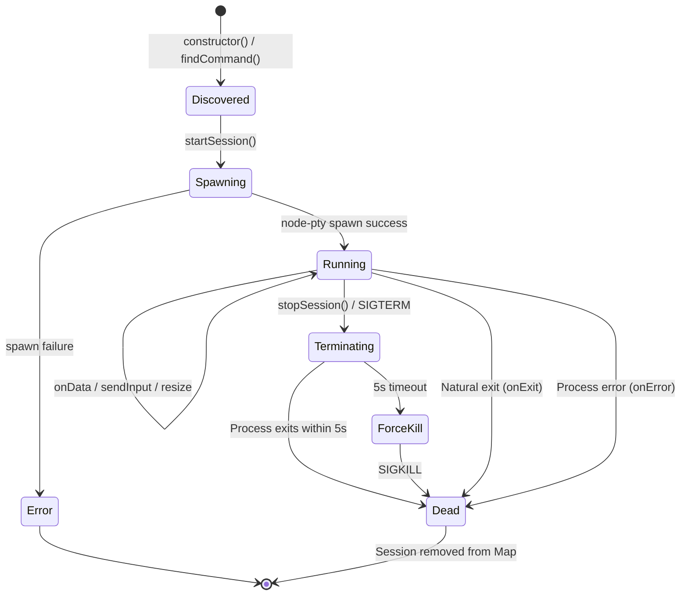

# Bridge Pattern

The bridge pattern is the core extensible architecture that allows ai-or-die to support multiple CLI tools through a uniform interface. Each CLI tool is wrapped in a bridge class that manages process spawning, I/O streaming, terminal resizing, and graceful shutdown.

## Bridge Class Structure

Every bridge class extends `BaseBridge` (`src/base-bridge.js`), which provides command discovery, PTY spawning, chunked writes, and session lifecycle management. The codebase has five implementations:

- **ClaudeBridge** (`src/claude-bridge.js`) -- wraps the `claude` CLI
- **CodexBridge** (`src/codex-bridge.js`) -- wraps the `codex` CLI
- **CopilotBridge** (`src/copilot-bridge.js`) -- wraps the `copilot` CLI
- **GeminiBridge** (`src/gemini-bridge.js`) -- wraps the `gemini` CLI
- **TerminalBridge** (`src/terminal-bridge.js`) -- wraps `bash` / `powershell`

All five share an identical public interface inherited from BaseBridge:

```
class Bridge {
    constructor()                           // Find the CLI command on disk
    findCommand() -> string                 // Platform-aware command discovery
    commandExists(command) -> boolean       // Check if command is in PATH
    startSession(sessionId, options) -> session
    sendInput(sessionId, data) -> void
    resize(sessionId, cols, rows) -> void
    stopSession(sessionId) -> void
    getSession(sessionId) -> session | undefined
    getAllSessions() -> session[]
    cleanup() -> void                       // Stop all sessions
}
```

### Internal State

Each bridge maintains a `Map<sessionId, session>` where a session object contains:

```javascript
{
    process: ptyProcess,    // The node-pty IPty instance
    workingDir: string,     // Working directory the process was spawned in
    created: Date,          // When the session was created
    active: boolean,        // Whether the process is still running
    killTimeout: number     // Timer ID for the SIGKILL escalation
}
```

## How to Add a New CLI Tool

Adding a new CLI tool requires changes in three places. Since all bridges extend `BaseBridge`, the implementation is minimal. This section walks through adding a hypothetical "Aider" CLI as an example.

### Step 1: Create the Bridge

Create `src/aider-bridge.js` extending `BaseBridge`:

```javascript
const BaseBridge = require('./base-bridge');

class AiderBridge extends BaseBridge {
  constructor() {
    super('Aider', {
      commandPaths: {
        linux: [
          '{HOME}/.local/bin/aider',
          'aider',
          '/usr/local/bin/aider',
          '/usr/bin/aider'
        ],
        win32: [
          '{HOME}\\AppData\\Local\\Programs\\aider\\aider',
          'aider'
        ]
      },
      defaultCommand: 'aider'
    });
  }
}

module.exports = AiderBridge;
```

`BaseBridge` handles everything else: async command discovery (using `where` on Windows, `which` on Linux), PTY spawning with `@lydell/node-pty`, chunked writes (4KB with 10ms delay for ConPTY safety), session lifecycle, and graceful shutdown (SIGTERM → 5s → SIGKILL). For detailed implementation of error handling, buffer management, and process cleanup, see `src/base-bridge.js`.

### Step 2: Register in the Server

In `src/server.js`:

1. Import and instantiate the bridge in the constructor
2. Add it to `getBridgeForAgent()` so `'aider'` maps to `this.aiderBridge`
3. Add a `case 'start_aider':` in `handleMessage()`

The server's generic `startTool()` method handles `input`, `resize`, `stop`, output broadcasting, and cleanup — no per-tool wiring needed.

### Step 3: No UI Changes Needed

The UI auto-generates tool cards from the `/api/config` endpoint, which enumerates all registered bridges and their availability. No client code changes are required.

---

## Platform-Aware Command Resolution

### Search Strategy

`BaseBridge.findCommandAsync()` tries multiple locations in order:

1. **Tool-specific home directory** -- e.g., `~/.claude/local/claude`, `~/.codex/local/codex`
2. **Bare command name** -- relies on `PATH` resolution (e.g., `claude`, `codex`)
3. **Alternative names** -- e.g., `claude-code` as a fallback for `claude`
4. **User-local bin** -- `~/.local/bin/{command}`
5. **System-wide locations** -- `/usr/local/bin/{command}`, `/usr/bin/{command}`

Paths use `{HOME}` as a placeholder that `BaseBridge` resolves via `os.homedir()` at runtime (cross-platform safe).

### PATH Lookup

`BaseBridge.commandExists()` is platform-aware — it uses `where` on Windows and `which` on Linux/macOS:

```javascript
commandExists(command) {
    try {
        const checker = this.isWindows ? 'where' : 'which';
        require('child_process').execFileSync(checker, [command], { stdio: 'ignore' });
        return true;
    } catch (error) {
        return false;
    }
}
```

### Home Directory Resolution

All bridges use `os.homedir()` for home directory resolution (cross-platform):

```javascript
// In BaseBridge, {HOME} placeholders are resolved:
const resolved = cmdPath.replace('{HOME}', os.homedir());
```

### Fallback Behavior

If no command is found at any of the searched locations, the bridge falls back to the bare command name (e.g., `'claude'`). This means the process will fail to spawn at runtime with a descriptive error, rather than failing silently at startup.

---

## Process Lifecycle



### Spawn (`startSession`)

The bridge spawns the CLI process using `@lydell/node-pty`:

```javascript
const process = spawn(this.command, args, {
    cwd: workingDir,
    env: {
        ...process.env,
        TERM: 'xterm-256color',
        FORCE_COLOR: '1',
        COLORTERM: 'truecolor'
    },
    cols,
    rows,
    name: 'xterm-color'
});
```

Three callbacks are registered on the process:

| Callback | Trigger | Action |
|----------|---------|--------|
| `onData(data)` | CLI writes to stdout/stderr | Forward to `onOutput` callback; append to rolling buffer |
| `onExit(code, signal)` | Process exits | Mark session inactive; remove from map; call `onExit` callback |
| `on('error', err)` | Spawn or runtime error | Mark session inactive; remove from map; call `onError` callback |

### Data Streaming (`onData`)

Each bridge maintains a rolling `dataBuffer` (capped at 10,000 characters, trimmed to the last 5,000) for internal use such as prompt detection. The raw output data is passed through to the server's `onOutput` callback without transformation.

### Input (`sendInput`)

Input is written to the PTY process via `BaseBridge.writeChunked()`, which splits large payloads into 4KB chunks with 10ms inter-chunk delays to prevent ConPTY buffer overflow on Windows:

```javascript
// BaseBridge.writeChunked() — safe for both platforms
for (let i = 0; i < data.length; i += PTY_WRITE_CHUNK_SIZE) {
    session.process.write(data.slice(i, i + PTY_WRITE_CHUNK_SIZE));
    if (i + PTY_WRITE_CHUNK_SIZE < data.length) await delay(PTY_WRITE_CHUNK_DELAY_MS);
}
```

### Resize

Terminal dimensions are updated on the PTY:

```javascript
session.process.resize(cols, rows);
```

This sends a `SIGWINCH` signal to the child process, causing it to re-query its terminal dimensions.

### Graceful Shutdown (`stopSession`)

Shutdown follows a two-phase approach:

1. **SIGTERM** -- Politely ask the process to terminate
2. **Wait 5 seconds** -- Give the process time to clean up
3. **SIGKILL** -- Force-kill if the process is still alive

```javascript
session.process.kill('SIGTERM');
session.killTimeout = setTimeout(() => {
    if (session.active && session.process) {
        session.process.kill('SIGKILL');
    }
}, 5000);
```

If the process exits naturally before the timeout, the `onExit` handler clears the kill timeout.

---

## node-pty Configuration

### Terminal Type

All bridges configure the PTY with:

```javascript
{
    TERM: 'xterm-256color',    // Terminal type for full color support
    FORCE_COLOR: '1',          // Force color output in CLIs that check
    COLORTERM: 'truecolor',    // Advertise 24-bit color support
    name: 'xterm-color'        // PTY name
}
```

This ensures CLI tools produce rich, colorized output that maps correctly to the xterm.js terminal in the browser.

### Default Dimensions

If not specified by the client, terminals default to 80 columns by 24 rows -- the standard VT100 size.

### Environment Inheritance

The PTY inherits the full server process environment (`...process.env`) with the terminal-specific variables overlaid. This means the CLI tools have access to API keys, PATH, and other environment variables set in the server's context.

### Windows Support (ConPTY)

`@lydell/node-pty` uses ConPTY on Windows automatically. `BaseBridge` handles all cross-platform concerns:

- Uses `where` on Windows, `which` on Linux in `commandExists()`
- Uses `os.homedir()` for home directory resolution
- Each bridge provides separate `commandPaths.win32` and `commandPaths.linux` search paths
- Chunked writes (4KB with 10ms inter-chunk delay) prevent ConPTY buffer overflow

---

## Trust Prompt Auto-Accept (Claude-Specific)

The `ClaudeBridge` has unique behavior not present in other bridges: it automatically handles Claude's workspace trust prompt.

When Claude CLI is launched in a new directory, it asks:

```
Do you trust the files in this folder?
```

The bridge detects this prompt in the output buffer and automatically sends a carriage return to accept it:

```javascript
// Buffer data to check for trust prompt
dataBuffer += data;

// Check for trust prompt and auto-accept it
if (!trustPromptHandled && dataBuffer.includes('Do you trust the files in this folder?')) {
    trustPromptHandled = true;
    setTimeout(() => {
        claudeProcess.write('\r');
    }, 500);
}
```

Key details:
- The flag `trustPromptHandled` ensures this only fires once per session
- A 500ms delay is added before sending the keystroke to ensure the prompt UI is fully rendered
- The `\r` (carriage return) confirms the default selection ("Enter to confirm")
- Other bridges do not need this because their CLIs do not have a trust prompt

---

## Data Buffer Management

Each bridge maintains a per-session rolling buffer for internal prompt detection:

```javascript
dataBuffer += data;
if (dataBuffer.length > 10000) {
    dataBuffer = dataBuffer.slice(-5000);
}
```

This is separate from the server-level `outputBuffer` (which stores the last 1000 output chunks for client reconnection replay). The bridge-level buffer is only used for pattern matching within the bridge itself (e.g., trust prompt detection in ClaudeBridge).
