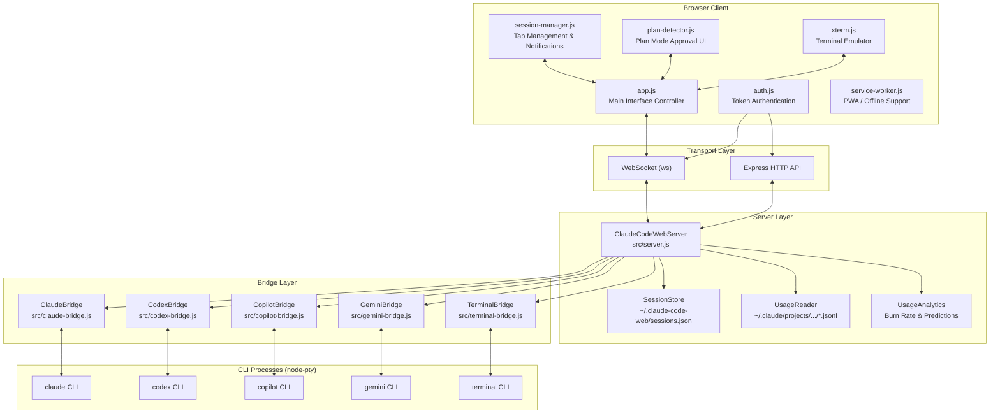
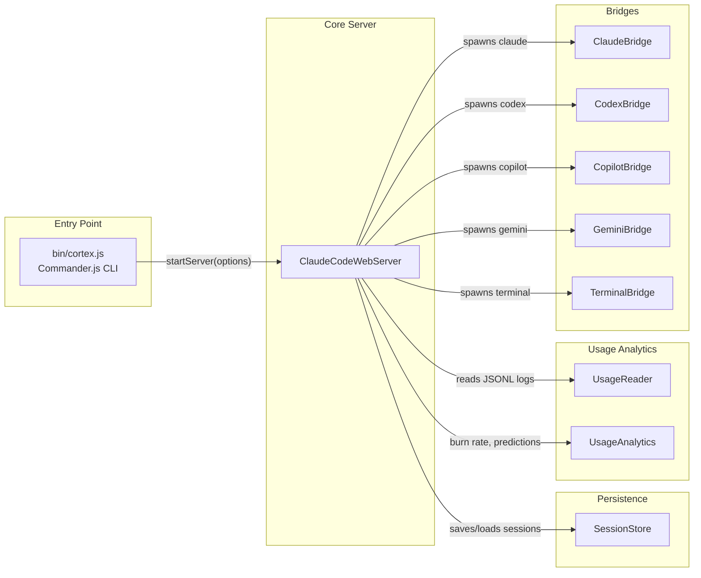
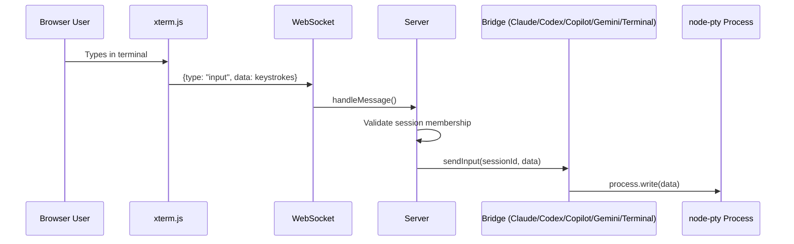
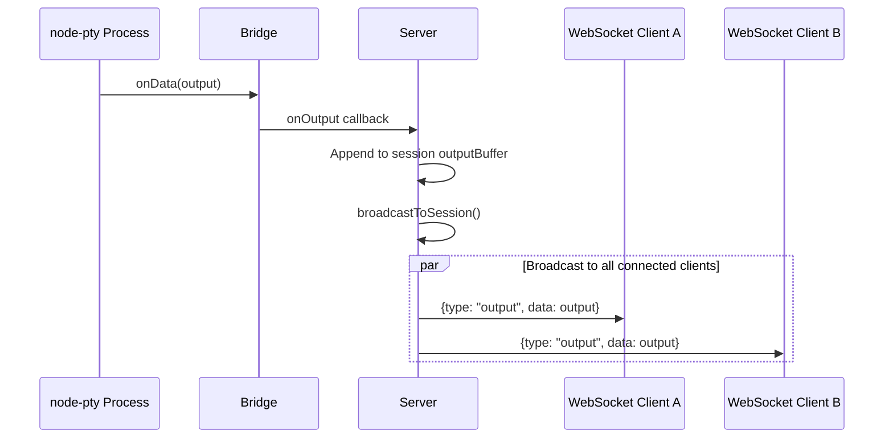
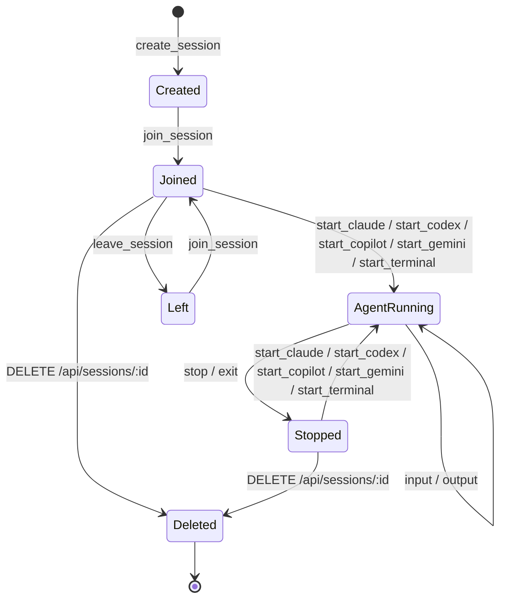

# Architecture Overview

Cortex is a Node.js web application that provides browser-based access to multiple AI CLI tools through a unified terminal interface. It wraps CLI processes (Claude, Codex, Copilot, Gemini, Terminal, and others) in pseudo-terminals and streams their I/O over WebSockets to xterm.js terminals running in the browser.

## System Architecture

## Component Relationships

## Data Flow

### User Input Flow

### Output Broadcast Flow

### Session Lifecycle

## Technology Stack

| Layer | Technology | Purpose |
|-------|-----------|---------|
| **CLI Entry** | Commander.js | Parse command-line arguments (`--port`, `--auth`, `--https`, etc.) |
| **HTTP Server** | Express 4.x | REST API, static file serving, authentication middleware |
| **WebSocket** | ws 8.x | Bidirectional real-time communication between browser and server |
| **PTY** | node-pty 1.x | Spawn CLI tools in pseudo-terminals with full ANSI/256-color support |
| **Terminal UI** | xterm.js | Browser-based terminal emulator with fit addon and web links |
| **Session IDs** | uuid v4 | Unique identifiers for sessions and WebSocket connections |
| **Tunneling** | devtunnel CLI | Optional public tunnel for remote access |
| **CORS** | cors | Cross-origin request handling |
| **PWA** | Service Worker | Progressive Web App support for offline/installable experience |

## Key Design Decisions

### 1. Bridge-per-CLI Architecture

Each supported CLI tool has its own bridge class that extends `BaseBridge` (`ClaudeBridge`, `CodexBridge`, `CopilotBridge`, `GeminiBridge`, `TerminalBridge`). All bridges share an identical interface (`startSession`, `sendInput`, `resize`, `stopSession`, `cleanup`), making it straightforward to add new tools. The server routes messages to the correct bridge based on the `session.agent` field.

### 2. Session-Centric Model

Sessions are the central organizing concept. A session represents a working directory plus an optional running CLI process. Multiple WebSocket connections can join the same session simultaneously, enabling multi-device access to the same terminal. Sessions persist to disk (`~/.claude-code-web/sessions.json`) and survive server restarts, though the CLI processes themselves do not persist.

### 3. Output Buffering for Reconnection

Each session maintains a rolling output buffer (last 1000 lines). When a client joins an existing session, the server replays the last 200 lines from the buffer, allowing the user to see recent context without needing the CLI process to re-emit output.

### 4. node-pty over child_process

The application uses `node-pty` instead of `child_process.spawn` because CLI tools like Claude Code produce rich terminal output (ANSI escape codes, 256-color sequences, cursor movement). A real pseudo-terminal is required to faithfully capture and replay this output. The PTY is configured with `xterm-256color` TERM and `truecolor` COLORTERM.

### 5. Authentication by Default

The server generates a random authentication token on startup if none is provided. All HTTP endpoints (except `/auth-status`) and WebSocket connections require this token. This prevents accidental exposure of the terminal interface, which has full access to the underlying CLI tools.

### 6. Path Validation and Sandboxing

The folder browser and working directory selection enforce that all paths remain within the base directory where the server was started (`process.cwd()`). Directory traversal attempts are rejected at both the API and session creation levels.

### 7. Graceful Shutdown with Escalation

When stopping a CLI process, the server sends `SIGTERM` first, then escalates to `SIGKILL` after a 5-second timeout if the process has not exited. This matches standard Unix process management and gives CLI tools a chance to clean up.

### 8. Auto-Save with Atomic Writes

Sessions are automatically saved to disk every 30 seconds. The save operation writes to a temporary file first, then renames it atomically to prevent corruption from interrupted writes. Sessions older than 7 days are discarded on load.
