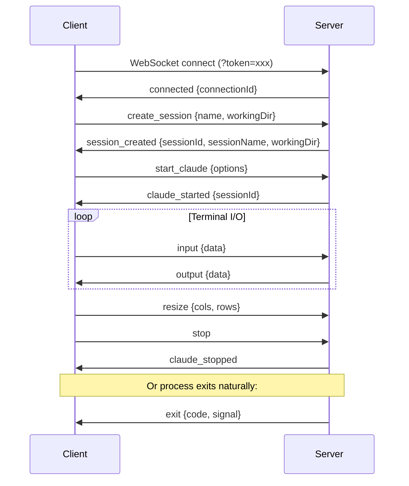
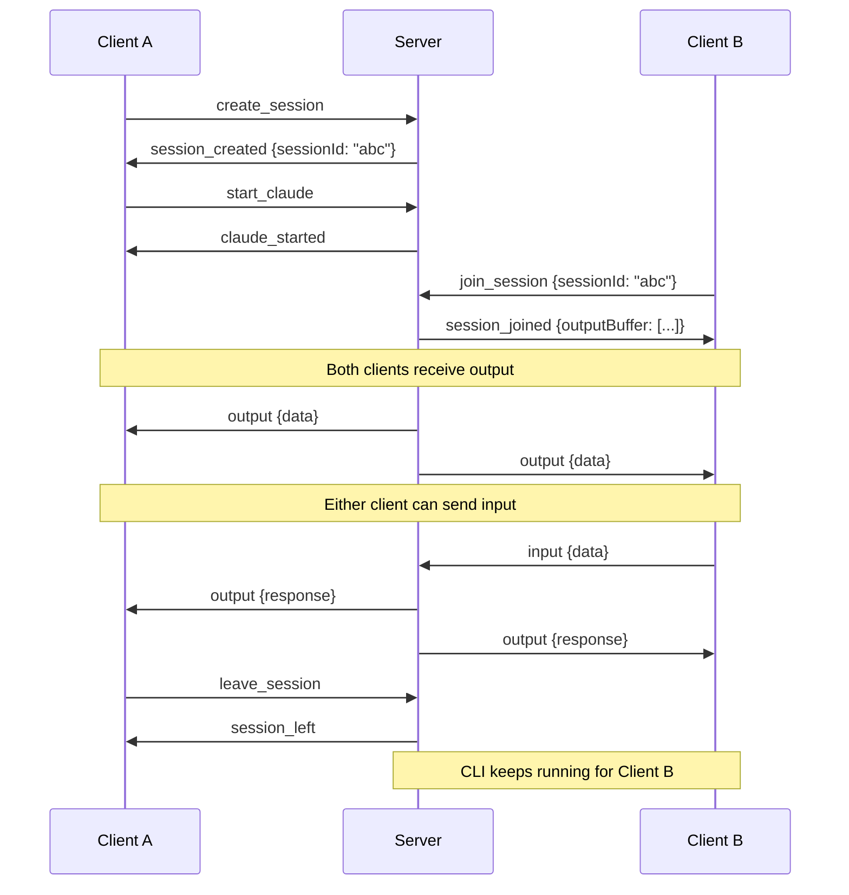

# WebSocket Protocol

This document describes the full WebSocket protocol used for real-time communication between the browser client and the ai-or-die server.

## Connection

Clients connect to the WebSocket server at:

```
ws://localhost:{port}?token={authToken}
```

Or with HTTPS:

```
wss://localhost:{port}?token={authToken}
```

If a `sessionId` query parameter is provided, the server will automatically join the client to that session after the connection handshake:

```
ws://localhost:{port}?token={authToken}&sessionId={sessionId}
```

All messages are JSON-encoded strings. Every message has a `type` field that identifies the message kind.

---

## Client-to-Server Messages

### `create_session`

Create a new session and automatically join it.

```json
{
  "type": "create_session",
  "name": "My Session",
  "workingDir": "/home/user/project"
}
```

| Field | Type | Required | Description |
|-------|------|----------|-------------|
| `name` | string | No | Human-readable session name. Defaults to `"Session {timestamp}"`. |
| `workingDir` | string | No | Working directory for the session. Must be within the server's base directory. Defaults to the selected working directory or the server's base folder. |

---

### `join_session`

Join an existing session. Receives the output buffer for replay.

```json
{
  "type": "join_session",
  "sessionId": "550e8400-e29b-41d4-a716-446655440000"
}
```

| Field | Type | Required | Description |
|-------|------|----------|-------------|
| `sessionId` | string (UUID) | Yes | The ID of the session to join. |

---

### `leave_session`

Disconnect from the current session without stopping the CLI process.

```json
{
  "type": "leave_session"
}
```

No additional fields. The server removes the WebSocket connection from the session's connection set but leaves the CLI process running.

---

### `start_claude`

Start the Claude CLI in the current session.

```json
{
  "type": "start_claude",
  "options": {
    "dangerouslySkipPermissions": false,
    "cols": 120,
    "rows": 40
  }
}
```

| Field | Type | Required | Description |
|-------|------|----------|-------------|
| `options.dangerouslySkipPermissions` | boolean | No | Pass `--dangerously-skip-permissions` to the Claude CLI. Default `false`. |
| `options.cols` | number | No | Terminal width in columns. Default `80`. |
| `options.rows` | number | No | Terminal height in rows. Default `24`. |

---

### `start_codex`

Start the Codex CLI in the current session.

```json
{
  "type": "start_codex",
  "options": {
    "dangerouslySkipPermissions": false,
    "cols": 120,
    "rows": 40
  }
}
```

| Field | Type | Required | Description |
|-------|------|----------|-------------|
| `options.dangerouslySkipPermissions` | boolean | No | Pass `--dangerously-bypass-approvals-and-sandbox` to the Codex CLI. Default `false`. |
| `options.cols` | number | No | Terminal width in columns. Default `80`. |
| `options.rows` | number | No | Terminal height in rows. Default `24`. |

---

### `start_copilot`

Start the Copilot CLI in the current session.

```json
{
  "type": "start_copilot",
  "options": {
    "cols": 120,
    "rows": 40
  }
}
```

| Field | Type | Required | Description |
|-------|------|----------|-------------|
| `options.cols` | number | No | Terminal width in columns. Default `80`. |
| `options.rows` | number | No | Terminal height in rows. Default `24`. |

---

### `start_gemini`

Start the Gemini CLI in the current session.

```json
{
  "type": "start_gemini",
  "options": {
    "cols": 120,
    "rows": 40
  }
}
```

| Field | Type | Required | Description |
|-------|------|----------|-------------|
| `options.cols` | number | No | Terminal width in columns. Default `80`. |
| `options.rows` | number | No | Terminal height in rows. Default `24`. |

---

### `start_terminal`

Start a raw terminal (bash/PowerShell) in the current session.

```json
{
  "type": "start_terminal",
  "options": {
    "cols": 120,
    "rows": 40
  }
}
```

| Field | Type | Required | Description |
|-------|------|----------|-------------|
| `options.cols` | number | No | Terminal width in columns. Default `80`. |
| `options.rows` | number | No | Terminal height in rows. Default `24`. |

---

### `input`

Send user input (keystrokes) to the running CLI process.

```json
{
  "type": "input",
  "data": "hello world\r"
}
```

| Field | Type | Required | Description |
|-------|------|----------|-------------|
| `data` | string | Yes | Raw terminal input data. Use `\r` for Enter. |

The server validates that the sending WebSocket connection belongs to the target session and that a CLI process is actively running before forwarding the input. If no agent is running, the server responds with an `info` or `error` message.

---

### `resize`

Update the terminal dimensions for the running CLI process.

```json
{
  "type": "resize",
  "cols": 120,
  "rows": 40
}
```

| Field | Type | Required | Description |
|-------|------|----------|-------------|
| `cols` | number | Yes | New terminal width in columns. |
| `rows` | number | Yes | New terminal height in rows. |

Resize is silently ignored if no agent is currently running.

---

### `stop`

Terminate the running CLI process in the current session.

```json
{
  "type": "stop"
}
```

No additional fields. The server sends `SIGTERM` to the process, then `SIGKILL` after a 5-second timeout if the process has not exited. The appropriate `*_stopped` message is broadcast to all connected clients.

---

### `ping`

Keepalive ping. The server responds with `pong`.

```json
{
  "type": "ping"
}
```

---

### `image_upload`

Upload an image (base64-encoded) to the running CLI process.

```json
{
  "type": "image_upload",
  "data": "data:image/png;base64,iVBOR...",
  "filename": "screenshot.png"
}
```

| Field | Type | Required | Description |
|-------|------|----------|-------------|
| `data` | string | Yes | Base64-encoded image data with MIME prefix. |
| `filename` | string | No | Original filename. |

---

### `get_usage`

Request current usage statistics (token counts, costs, burn rate, session timer).

```json
{
  "type": "get_usage"
}
```

No additional fields. The server reads Claude's JSONL usage logs, calculates analytics, and responds with a `usage_update` message.

---

## Server-to-Client Messages

### `connected`

Sent immediately after the WebSocket connection is established.

```json
{
  "type": "connected",
  "connectionId": "550e8400-e29b-41d4-a716-446655440000"
}
```

| Field | Type | Description |
|-------|------|-------------|
| `connectionId` | string (UUID) | Unique identifier for this WebSocket connection. |

---

### `session_created`

Confirmation that a new session was created and the client has joined it.

```json
{
  "type": "session_created",
  "sessionId": "550e8400-e29b-41d4-a716-446655440000",
  "sessionName": "My Session",
  "workingDir": "/home/user/project"
}
```

| Field | Type | Description |
|-------|------|-------------|
| `sessionId` | string (UUID) | The new session's unique identifier. |
| `sessionName` | string | The human-readable session name. |
| `workingDir` | string | The resolved working directory. |

---

### `session_joined`

Confirmation that the client has joined an existing session. Includes the output buffer for replaying recent terminal output.

```json
{
  "type": "session_joined",
  "sessionId": "550e8400-e29b-41d4-a716-446655440000",
  "sessionName": "My Session",
  "workingDir": "/home/user/project",
  "active": true,
  "outputBuffer": ["line1\r\n", "line2\r\n"]
}
```

| Field | Type | Description |
|-------|------|-------------|
| `sessionId` | string (UUID) | The session's unique identifier. |
| `sessionName` | string | The human-readable session name. |
| `workingDir` | string | The session's working directory. |
| `active` | boolean | Whether a CLI process is currently running. |
| `outputBuffer` | string[] | The last 200 lines of terminal output for replay. |

---

### `session_left`

Confirmation that the client has left the current session.

```json
{
  "type": "session_left"
}
```

---

### `claude_started`

Broadcast to all clients in the session when the Claude CLI process starts.

```json
{
  "type": "claude_started",
  "sessionId": "550e8400-e29b-41d4-a716-446655440000"
}
```

---

### `codex_started`

Broadcast to all clients in the session when the Codex CLI process starts.

```json
{
  "type": "codex_started",
  "sessionId": "550e8400-e29b-41d4-a716-446655440000"
}
```

---

### `copilot_started`

Broadcast when the Copilot CLI process starts.

```json
{
  "type": "copilot_started",
  "sessionId": "550e8400-e29b-41d4-a716-446655440000"
}
```

---

### `gemini_started`

Broadcast when the Gemini CLI process starts.

```json
{
  "type": "gemini_started",
  "sessionId": "550e8400-e29b-41d4-a716-446655440000"
}
```

---

### `terminal_started`

Broadcast when a raw terminal session starts.

```json
{
  "type": "terminal_started",
  "sessionId": "550e8400-e29b-41d4-a716-446655440000"
}
```

---

### `output`

Terminal output from the running CLI process. Broadcast to all clients connected to the session.

```json
{
  "type": "output",
  "data": "\u001b[32mHello World\u001b[0m\r\n"
}
```

| Field | Type | Description |
|-------|------|-------------|
| `data` | string | Raw terminal output including ANSI escape sequences. |

This is the highest-frequency message type. Output is streamed in real time as the CLI process writes to its PTY.

---

### `exit`

The CLI process has exited. Broadcast to all clients in the session.

```json
{
  "type": "exit",
  "code": 0,
  "signal": null
}
```

| Field | Type | Description |
|-------|------|-------------|
| `code` | number | The process exit code. `0` indicates success. |
| `signal` | string \| null | The signal that terminated the process, if any (e.g., `"SIGTERM"`, `"SIGKILL"`). |

---

### `error`

An error occurred. Sent to the originating client or broadcast to the session depending on context.

```json
{
  "type": "error",
  "message": "Failed to start Claude Code: command not found"
}
```

| Field | Type | Description |
|-------|------|-------------|
| `message` | string | Human-readable error description. |

Common error scenarios:
- No session joined when trying to start a CLI or send input
- Agent already running in the session
- Session not found when joining
- CLI command not found on the system
- Path validation failure

---

### `claude_stopped` / `codex_stopped` / `copilot_stopped` / `gemini_stopped` / `terminal_stopped`

Broadcast to all clients in the session when the corresponding CLI process is explicitly stopped via the `stop` message.

```json
{
  "type": "claude_stopped"
}
```

These messages indicate the process was stopped by user action, as opposed to `exit` which indicates the process terminated on its own.

---

### `usage_update`

Response to `get_usage`. Contains comprehensive usage analytics.

```json
{
  "type": "usage_update",
  "sessionStats": {
    "requests": 42,
    "inputTokens": 150000,
    "outputTokens": 85000,
    "cacheCreationTokens": 12000,
    "cacheReadTokens": 45000,
    "cacheTokens": 57000,
    "totalTokens": 235000,
    "totalCost": 4.52,
    "models": {
      "sonnet": { "requests": 40, "inputTokens": 145000, "outputTokens": 82000, "cost": 4.10 },
      "opus": { "requests": 2, "inputTokens": 5000, "outputTokens": 3000, "cost": 0.42 }
    },
    "sessionStartTime": "2025-01-15T10:00:00.000Z",
    "lastUpdate": "2025-01-15T12:30:00.000Z",
    "sessionNumber": 1,
    "isExpired": false
  },
  "dailyStats": {
    "requests": 120,
    "totalTokens": 680000,
    "totalCost": 12.80,
    "periodHours": 24,
    "hourlyRate": 5.0,
    "tokensPerHour": 28333,
    "costPerHour": 0.53
  },
  "sessionTimer": {
    "startTime": "2025-01-15T10:00:00.000Z",
    "elapsed": 9000000,
    "remaining": 9000000,
    "formatted": "02:30:00",
    "remainingFormatted": "02:30",
    "hours": 2,
    "minutes": 30,
    "seconds": 0,
    "remainingMs": 9000000,
    "sessionDurationHours": 5,
    "sessionNumber": 1,
    "isExpired": false,
    "burnRate": 450.5,
    "burnRateConfidence": 0.82,
    "depletionTime": "2025-01-15T14:15:00.000Z",
    "depletionConfidence": 0.75
  },
  "analytics": {
    "currentSession": { "id": "session_1", "startTime": "...", "endTime": "...", "tokens": 235000, "remaining": -15000, "percentUsed": 106.8 },
    "burnRate": { "current": 450.5, "trend": "stable", "history": [] },
    "predictions": { "depletionTime": "...", "confidence": 0.75, "minutesRemaining": 105 },
    "plan": { "type": "max20", "limits": { "tokens": 220000, "cost": 140.00, "messages": 2000 } }
  },
  "burnRate": { "rate": 450.5, "confidence": 0.82, "dataPoints": 42 },
  "overlappingSessions": 0,
  "plan": "max20",
  "limits": { "tokens": 220000, "cost": 140.00, "messages": 2000, "algorithm": "fixed" }
}
```

---

### `image_upload_complete`

Broadcast when an image upload is successfully processed.

```json
{
  "type": "image_upload_complete",
  "sessionId": "550e8400-e29b-41d4-a716-446655440000",
  "filename": "screenshot.png"
}
```

---

### `image_upload_error`

Sent when an image upload fails.

```json
{
  "type": "image_upload_error",
  "message": "Failed to process image"
}
```

---

### `session_deleted`

Sent to all clients connected to a session that has been deleted via the REST API.

```json
{
  "type": "session_deleted",
  "message": "Session has been deleted"
}
```

After receiving this message, the client's WebSocket connection is closed by the server.

---

### `pong`

Response to a `ping` message.

```json
{
  "type": "pong"
}
```

---

### `info`

Informational message, typically sent when the user attempts to send input without a running agent.

```json
{
  "type": "info",
  "message": "No agent is running. Choose an option to start."
}
```

---

## Message Flow Diagrams

### Full Session Lifecycle



### Multi-Client Session Sharing



## REST API Endpoints

The server also exposes REST endpoints for operations that do not require real-time streaming:

| Method | Endpoint | Description |
|--------|----------|-------------|
| `GET` | `/auth-status` | Check if authentication is required (no auth needed) |
| `POST` | `/auth-verify` | Validate an authentication token |
| `GET` | `/api/health` | Server health check with session/connection counts |
| `GET` | `/api/config` | Server configuration (folder mode, aliases, tool availability, base folder) |
| `GET` | `/api/sessions/list` | List all sessions with metadata |
| `GET` | `/api/sessions/persistence` | Session storage metadata |
| `POST` | `/api/sessions/create` | Create a new session (REST alternative to WS) |
| `GET` | `/api/sessions/:id` | Get session details |
| `DELETE` | `/api/sessions/:id` | Delete a session and stop its CLI process |
| `GET` | `/api/folders` | Browse directories (with path validation) |
| `POST` | `/api/folders/select` | Select a working directory |
| `POST` | `/api/set-working-dir` | Set the server's default working directory |
| `POST` | `/api/create-folder` | Create a new directory |
| `POST` | `/api/close-session` | Clear the selected working directory |
| `GET` | `/api/files/stat` | Get file metadata (size, type, modified time) |
| `GET` | `/api/files/content` | Read file content (text files) |
| `PUT` | `/api/files/content` | Write/update file content |
| `GET` | `/api/files/download` | Download a file |
| `POST` | `/api/files/upload` | Upload a file |
| `GET` | `/api/tunnel/status` | Get Dev Tunnel connection status |
| `POST` | `/api/tunnel/restart` | Restart the Dev Tunnel |
| `POST` | `/api/tools/:toolId/recheck` | Re-check tool availability |
