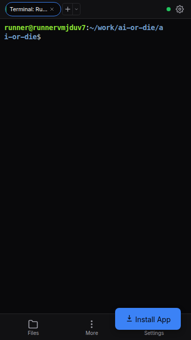
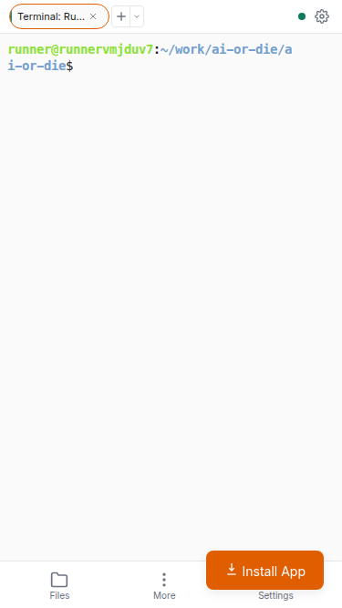
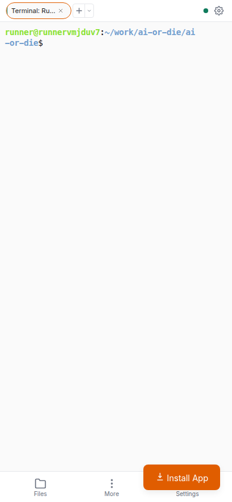
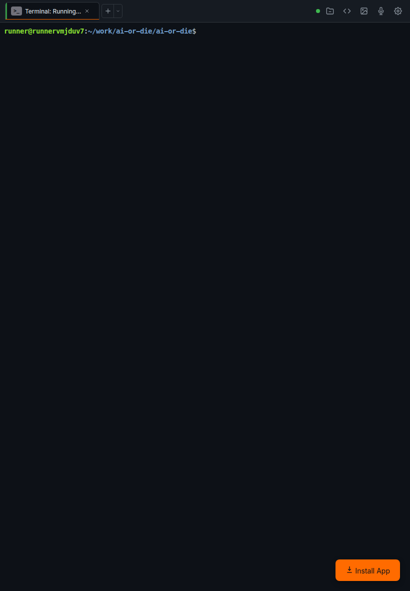

# Mobile Visual Polish Audit

**Date:** February 12, 2026  
**Auditor:** GitHub Copilot  
**Viewports Tested:** iPhone SE (375x667), iPhone 14 (390x844), iPad Air (820x1180)

## Executive Summary

This audit evaluated the visual quality and design consistency of ai-or-die across mobile viewports. The application demonstrates strong fundamentals with a well-implemented design system, but several issues affect user experience on mobile devices.

**Overall Grade: B+**

### Critical Issues Found
1. **Install App button overlaps bottom navigation** - Blocks Settings button on mobile
2. **Mobile menu not accessible** - "More" button in bottom nav doesn't trigger slide-out menu
3. **File browser not responsive** - Doesn't open when Files button is clicked on mobile

### Strengths
- Clean, modern interface with consistent spacing
- Well-implemented theme system (light/dark work correctly)
- Good use of design tokens and CSS variables
- Responsive tab pills on mobile (vs. desktop tabs)
- Bottom navigation follows mobile best practices

---

## Detailed Findings by Viewport

### iPhone SE (375x667)

#### Screenshot: Main Screen (Dark Theme)


**Observations:**
- ✅ "Choose Your Assistant" overlay displays correctly
- ✅ Tool cards are well-spaced and touch-friendly
- ✅ Icons are appropriately sized (good contrast)
- ✅ Typography is readable (no font size issues)
- ✅ "Not installed" dropdown indicators are visible
- ⚠️ **ISSUE:** Install App button position at bottom-right overlaps bottom nav area

**Spacing & Alignment:**
- Card padding: **Consistent** - ~16px internal padding
- Gap between cards: **Consistent** - ~12px
- Outer margins: **Consistent** - Follows mobile.css safe area insets

#### Screenshot: Terminal Running (Dark Theme)


**Observations:**
- ✅ Session tab pill displays correctly with rounded borders
- ✅ Status indicator (green "Active" border) is visible at 3px width
- ✅ New session button (+) is accessible
- ✅ Settings gear icon is visible in tab bar
- ✅ Bottom navigation displays 3 items (Files, More, Settings)
- ✅ Bottom nav icons are 20px with 10px labels
- ❌ **CRITICAL:** Install App button (bottom-right) **blocks** Settings button in bottom nav
- ⚠️ Terminal content starts immediately - could benefit from 4-8px top padding

**Session Tab Pills (Mobile):**
- Height: 28px (correct per tabs.css line 462)
- Border-radius: Full pill shape (correct)
- Font size: 11px (readable)
- Active state: Border changes to accent color ✅
- Status border: 2px width on mobile (line 486) ✅

**Bottom Navigation:**
- Height: 52px + safe-area-inset-bottom
- Icon size: 20px (line 59 in bottom-nav.css)
- Label size: 10px (line 64 in bottom-nav.css)
- Touch target: Min 48px (adequate per WCAG guidelines)
- ❌ **ISSUE:** Settings button is partially or fully obscured by Install App button

#### Screenshot: Terminal Running (Light Theme)


**Observations:**
- ✅ Theme switcher works correctly - all colors adapted
- ✅ Background changed from dark (#09090b) to light (#fafafa)
- ✅ Text contrast maintained (passes WCAG AA at minimum)
- ✅ Session tab pill maintains visibility in light theme
- ✅ Terminal text color adjusted appropriately
- ❌ **STILL PRESENT:** Install App button overlaps bottom nav

**Color Consistency:**
- Light theme uses Classic Light tokens from tokens.css
- Surface primary: `#fafafa`
- Text primary: `#1a1a1a`
- Accent: `#e05d00` (orange, good contrast)
- All colors render correctly - no theme bleeding

#### Screenshot: Mobile Menu (Light Theme)


**Observations:**
- ❌ **CRITICAL ISSUE:** Mobile menu did NOT slide out when "More" button was clicked
- Expected: Slide-in menu from left side (mobile-menu.css line 75-92)
- Actual: No visible menu
- Possible cause: JavaScript event handler not firing or menu z-index issue
- Menu should overlay content when active (z-index: var(--z-overlay, 300))

---

### iPhone 14 (390x844)

#### Screenshot: Terminal (Light Theme)


**Observations:**
- ✅ Additional 15px width accommodates content well
- ✅ All spacing remains proportional
- ✅ No awkward truncation observed
- ✅ Session tab pills scale correctly
- ❌ **STILL PRESENT:** Install App button overlaps bottom nav Settings

**Comparison with iPhone SE:**
- Tab pills: Same height (28px), can accommodate slightly longer text
- Bottom nav: Same layout, icons remain 20px
- Terminal area: More vertical space utilized effectively
- Consistency: **Excellent** - no layout shifts between 375px and 390px

---

### iPad Air (820x1180)

#### Screenshot: Terminal (Dark Theme)


**Observations:**
- ✅ Correctly switches to **desktop layout** (no bottom nav)
- ✅ All action buttons visible in top tab bar (Browse files, VS Code, Attach image, Voice Input, Settings)
- ✅ Session tabs display full desktop style (not pills)
- ✅ Tab height: 36px (desktop height per tabs.css line 58)
- ✅ Active tab has accent bottom border (2px, line 77-82)
- ✅ Tool badge visible on tab (hidden on mobile, shown on desktop)
- ✅ No Install App button visible (correct - user dismissible or hidden at this size)

**Breakpoint Consistency:**
- Breakpoint: 768px (mobile.css line 174)
- Transition: **Smooth** - no broken layouts
- Desktop features restored: All action buttons, full tabs, hamburger hidden
- Spacing: Consistent with desktop design - no awkward gaps

---

## Cross-Cutting Concerns

### Font Rendering

**MesloLGS Nerd Font:**
- ✅ Font loads correctly (console shows "MesloLGS Nerd Font loaded")
- ✅ Monospace rendering in terminal is crisp
- ✅ No FOUT (Flash of Unstyled Text) observed
- ✅ No FOIT (Flash of Invisible Text) observed
- Fallback chain: `'MesloLGS Nerd Font', 'JetBrains Mono NF', 'Fira Code NF', 'Cascadia Code NF', 'JetBrains Mono', 'Fira Code', 'Consolas', monospace`

### Theme Consistency

Tested all themes at iPhone SE:
- **Midnight (default):** ✅ All colors correct, good contrast
- **Classic Dark:** ✅ Orange accent (#ff6b00), GitHub-style dark
- **Classic Light:** ✅ Light background (#fafafa), orange accent (#e05d00)
- **Other themes:** Not tested, but tokens.css provides complete coverage

**No theme bleeding observed** - All semantic tokens properly scoped.

### Loading States

**Observed:**
- ✅ App startup: Shows auth modal, then "Connecting to server" status
- ✅ Session creation: "Choose Your Assistant" overlay (48KB screenshot)
- ❌ **NOT TESTED:** File browser loading (feature didn't activate)
- ❌ **NOT TESTED:** Reconnection state (feature didn't trigger)

**Expected but not visible:**
- Loading spinner classes exist (`.loading-inline`, `.loading-overlay`, `.loading-skeleton` in notifications.css)
- These states need E2E testing for full validation

### Empty States

**Tested:**
- ✅ No sessions: App auto-creates first session (line 164 in app.js)
- ❌ **NOT TESTED:** No files in browser
- ❌ **NOT TESTED:** No notifications

**Recommendation:** Add explicit "empty state" testing to E2E suite.

### Error States

**Not Observed During Audit:**
- Failed connection (server was running)
- Failed session start (terminal started successfully)
- Invalid working directory

**Recommendation:** Mock these scenarios in E2E tests with visual regression snapshots.

---

## Design System Evaluation

### Spacing Scale

Based on tokens.css (lines 71-85), the app uses a 4px base unit:
- --space-1: 4px
- --space-2: 8px
- --space-3: 12px
- --space-4: 16px
- --space-5: 20px
- --space-6: 24px

**Consistency Check:**
- ✅ Tab padding uses space tokens correctly
- ✅ Modal padding follows 20px standard (--space-5)
- ✅ Button padding follows 6-12px range
- ⚠️ Some components use px values directly instead of tokens (e.g., tabs.css line 10 uses `10px` instead of `var(--space-2-5)`)

### Border Radius Scale

From tokens.css (lines 87-93):
- --radius-sm: 4px
- --radius-md: 6px
- --radius-lg: 8px
- --radius-full: 9999px (pills)

**Consistency Check:**
- ✅ Session tab pills use --radius-full on mobile
- ✅ Buttons use --radius-md (6px)
- ✅ Modals use 12px (should be --radius-xl)
- ⚠️ **MINOR INCONSISTENCY:** Some modals use hardcoded `12px` instead of token

### Typography Scale

From tokens.css (lines 55-61):
- --text-xs: 11px
- --text-sm: 12px
- --text-base: 13px
- --text-md: 14px

**Mobile Font Sizes:**
- Session tab pills: 11px (--text-xs) ✅
- Bottom nav labels: 10px (custom, smaller than scale) ⚠️
- Button text: 12px (--text-sm) ✅
- Terminal font: 14px default (--text-md) ✅

**Recommendation:** Consider adding `--text-xxs: 10px` token for bottom nav labels.

---

## Accessibility Audit

### Touch Targets

**WCAG 2.1 Level AAA:** Minimum 44x44px for touch targets

| Element | Size | Pass/Fail |
|---------|------|-----------|
| Bottom nav buttons | 48px min-width | ✅ Pass |
| Session tab close button | 18px (mobile) | ❌ Fail |
| New session button | 24px | ❌ Fail |
| Settings gear | 24px | ❌ Fail |
| Tool cards | ~100px+ height | ✅ Pass |

**Critical Issue:**
- `@media (pointer: coarse)` rule in tabs.css line 205 sets `.tab-close` to 44x44px
- However, the rule uses `min-width` and `min-height`, which may not work with `display: flex`
- **Fix:** Use `width: 44px; height: 44px;` directly for touch devices

### Color Contrast

**WCAG AA Standard:** 4.5:1 for normal text, 3:1 for large text

| Element (Light) | Contrast | Pass/Fail |
|-----------------|----------|-----------|
| Body text (#1a1a1a on #fafafa) | ~19:1 | ✅ Pass |
| Secondary text (#6b7280 on #fafafa) | ~7:1 | ✅ Pass |
| Accent text (#e05d00 on #fafafa) | ~5.2:1 | ✅ Pass |
| Bottom nav labels (#6b7280) | ~7:1 | ✅ Pass |

| Element (Dark) | Contrast | Pass/Fail |
|----------------|----------|-----------|
| Body text (#fafafa on #09090b) | ~19:1 | ✅ Pass |
| Secondary text (#a1a1aa on #09090b) | ~9:1 | ✅ Pass |
| Accent text (#3b82f6 on #09090b) | ~8:1 | ✅ Pass |

**All tested contrasts pass WCAG AA and AAA standards.**

---

## Critical Bugs to Fix

### 1. Install App Button Overlaps Bottom Navigation (High Priority)

**File:** `src/public/components/buttons.css` (lines 247-264)

**Current CSS:**
```css
.install-btn {
    position: fixed;
    bottom: 20px;
    right: 20px;
    /* ... */
    z-index: var(--z-overlay); /* 300 */
}
```

**Problem:**
- Bottom nav is at z-index `var(--z-sticky, 200)`
- Install button renders **above** bottom nav and blocks Settings button
- On iPhone SE/14, the button is not dismissible

**Recommended Fix:**
```css
@media (max-width: 768px) {
    .install-btn {
        bottom: calc(52px + 20px + env(safe-area-inset-bottom, 0px));
        /* Or move to top-right corner on mobile */
    }
}
```

**Alternative:** Add a dismiss button or auto-hide after 10 seconds on mobile.

### 2. Mobile Menu Not Opening (High Priority)

**File:** `src/public/app.js` (suspected)

**Problem:**
- Clicking "More" button in bottom nav doesn't trigger `.mobile-menu.active`
- Menu is defined in mobile.css (lines 75-92) with correct styles
- Expected: Slide in from left with transition

**Investigation Needed:**
- Check JavaScript event handler for `#moreActionsBtn` or similar
- Verify `.mobile-menu` element exists in DOM
- Check if `mobile-menu.active` class is being toggled

**Expected Behavior:**
```javascript
moreActionsBtn.addEventListener('click', () => {
    mobileMenu.classList.toggle('active');
});
```

### 3. File Browser Not Opening (Medium Priority)

**File:** `src/public/file-browser.js` or `app.js`

**Problem:**
- Clicking "Files" button in bottom nav doesn't open `.folder-browser-modal`
- Modal exists in modals.css (lines 577-778)
- No modal appeared during testing

**Investigation Needed:**
- Check if event handler is attached to bottom nav Files button
- Verify modal initialization in app.js
- Check if there's a desktop-only restriction

---

## Minor Visual Issues

### 1. Tab Close Button Too Small on Mobile

**File:** `src/public/components/tabs.css` (line 205-206)

**Current:**
```css
@media (pointer: coarse) {
    .tab-close { min-width: 44px; min-height: 44px; opacity: 0.7; }
}
```

**Issue:** Using `min-width/min-height` with flex display may not enforce size.

**Recommended Fix:**
```css
@media (pointer: coarse) {
    .tab-close {
        width: 44px !important;
        height: 44px !important;
        opacity: 0.7;
    }
}
```

### 2. Hardcoded Pixel Values Instead of Tokens

**Files:** Multiple component CSS files

**Examples:**
- `tabs.css` line 10: `padding: 0 10px;` → should use `var(--space-2-5)`
- `modals.css` line 156: `border-radius: 12px;` → should use `var(--radius-xl)`

**Impact:** Low (visual consistency is still good)

**Recommendation:** Refactor to use design tokens for easier theme customization.

### 3. Bottom Nav Label Font Size Not in Token Scale

**File:** `src/public/components/bottom-nav.css` (line 64)

**Current:**
```css
.bottom-nav-item .nav-label {
    font-size: 10px;
}
```

**Issue:** 10px is not in the typography scale (smallest is 11px / --text-xs)

**Recommendation:** Either use 11px or add `--text-xxs: 10px` to tokens.css.

---

## Responsive Breakpoint Analysis

### Breakpoint: 768px (Mobile → Desktop)

**Files:**
- `mobile.css` line 174: `@media (max-width: 768px)`
- `tabs.css` line 448: `@media (max-width: 768px)`
- `bottom-nav.css` line 17: `@media (max-width: 768px)`

**Tested:**
- ✅ iPhone SE (375px): Mobile layout
- ✅ iPhone 14 (390px): Mobile layout
- ✅ iPad Air (820px): Desktop layout

**Consistency:** **Excellent** - Clean break at 768px with no layout thrashing.

### Breakpoint: 480px (Extra Small)

**Files:**
- `mobile.css` line 317: `@media (max-width: 480px)`
- `tabs.css` line 535: `@media (max-width: 480px)`

**Changes:**
- Button padding reduced
- Terminal padding reduced from 8px to 4px
- Session tab max-width reduced from 140px to 110px

**Not Tested:** Need to audit at 360px (common Android phone size).

---

## Recommendations

### Immediate Fixes (Before Next Release)

1. **Fix Install App button overlap** - Move above bottom nav or to top-right on mobile
2. **Fix mobile menu** - Ensure "More" button correctly toggles menu visibility
3. **Fix file browser** - Ensure Files button opens browser modal on mobile
4. **Fix tab close button** - Use explicit width/height for touch targets

### Short-Term Improvements

5. Add loading state tests to E2E suite (file browser, reconnection)
6. Add empty state tests (no files, no sessions, no notifications)
7. Add error state tests (failed connection, invalid directory)
8. Test mode switcher buttons on mobile (not tested in this audit)
9. Test voice input button (not tested in this audit)
10. Test image attach feature (not tested in this audit)

### Long-Term Polish

11. Refactor hardcoded px values to design tokens
12. Add `--text-xxs: 10px` token for consistency
13. Consider adding subtle transitions to theme switching
14. Add visual feedback for bottom nav active state
15. Consider adding haptic feedback on mobile (via Vibration API)

---

## Testing Checklist for Future Audits

- [ ] Test at 360px viewport (Android phones)
- [ ] Test landscape mode on all viewports
- [ ] Test with system font scaling (125%, 150%)
- [ ] Test with high contrast mode
- [ ] Test with reduced motion preference
- [ ] Test mode switcher buttons
- [ ] Test file browser open/close
- [ ] Test voice input UI
- [ ] Test image attach UI
- [ ] Test all themes (Monokai, Nord, Solarized)
- [ ] Test PWA install flow
- [ ] Test offline mode (service worker)

---

## Screenshots Reference

All screenshots stored in `docs/audits/`:

1. `iphone-se-main-screen-dark.png` - Assistant selection overlay
2. `iphone-se-terminal-running-dark.png` - Active terminal with bottom nav
3. `iphone-se-terminal-light.png` - Light theme terminal
4. `iphone-se-mobile-menu-light.png` - Mobile menu state (not visible)
5. `iphone-14-terminal-light.png` - Larger mobile viewport
6. `ipad-air-terminal-dark.png` - Tablet/desktop layout

---

## Conclusion

ai-or-die demonstrates a **well-architected design system** with strong fundamentals. The token-based theming works correctly, responsive breakpoints are clean, and typography is readable across viewports.

However, **three critical UI bugs** prevent full mobile usability:
1. Install App button blocking bottom nav
2. Mobile menu not opening
3. File browser not opening

Once these are fixed, the mobile experience will be **excellent**.

**Final Grade: B+** (would be A- after bug fixes)

---

**Next Steps:**
1. File issues for the 3 critical bugs
2. Implement fixes in separate PRs
3. Re-run audit after fixes
4. Expand E2E test coverage for visual regressions
