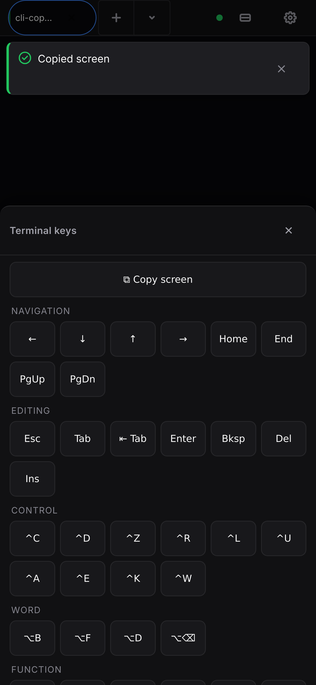

# Claude and Copilot CLI copy coverage

## What Happened

The desktop context menu showed `Copy` in a gray, non-interactive state for
current Claude CLI and Copilot CLI sessions whenever no xterm selection existed.
The same behavior was exposed by full-screen TUI output from either provider.

## Root Cause

Both provider routes render into the same node-pty/WebSocket/xterm pipeline. The
shared context-menu code treated `hasSelection() === false` as disabled and its
copy action only read `getSelection()`. The provider label and current CLI
version were exposure conditions, not separate clipboard implementations.

## Fix

The copy gate now tests the provider-agnostic production route/UI contract with
a deterministic Node fixture. The fixture emits ANSI-wrapped, tool-labelled
output and stays alive for the copy action. Context-menu, command-palette, and
iPhone16 WebKit Control-mode tests exercise selection-first visible-viewport copy.
The test suite blocks service workers for deterministic copy assertions, while PWA
tests retain their explicit service-worker coverage. Older evidence that described
the command-palette action as full-buffer is historical and no longer describes
the current action.

The fixture proves bridge routing, PTY/WebSocket delivery, xterm buffer
extraction, logical wrapped-line handling, and UI copy behavior. It does not
prove the latest real Claude or Copilot CLI was installed, authenticated, or
run. Real-latest-CLI and physical-device checks remain a separate manual gate.
The client uses xterm 6.0.0 with the DOM renderer on mobile, and the production
service worker currently uses cache name `ai-or-die-v13`.

## Watch For

Do not gate terminal `Copy` on `hasSelection()`. Keep visible-screen copy
selection-first and keep Ctrl/Cmd+C without a selection available to xterm for
SIGINT. Do not use a fixture pass as latest-CLI evidence, do not link an
untracked screenshot, and do not add a synthetic click fallback that can hide a
broken mobile touch path.

## Evidence

A screenshot was captured from the iPhone16 WebKit project after the successful
Claude fixture copy action:



The Copilot screenshot referenced by an earlier version of this record is not
present and is intentionally not linked. A future PNG may be linked only after
a passing run produces and tracks it.

## Reproducing the evidence

```bash
AIORDIE_CLI_COPY_SCREENSHOT_DIR="$PWD/docs/history/2026-08-24-cli-copy" \
  npx playwright test --config e2e/playwright.config.js \
  --project=client-redesign-webkit --grep "CLI-specific terminal copy"
```

The test attaches screenshots to Playwright results and writes tool-named PNGs
only when the environment variable is set for a passing, non-retry run.

## Manual evidence fields

Record device and OS/browser versions, provider and route, fixture versus real
CLI boundary, project or command, viewport/orientation, copy surface, selection
state, copied marker/text result, keyboard and geometry observations,
service-worker mode, screenshot/video artifact path, observer/date, and
pass/fail. Do not infer real-device or latest-CLI status from a fixture run.
